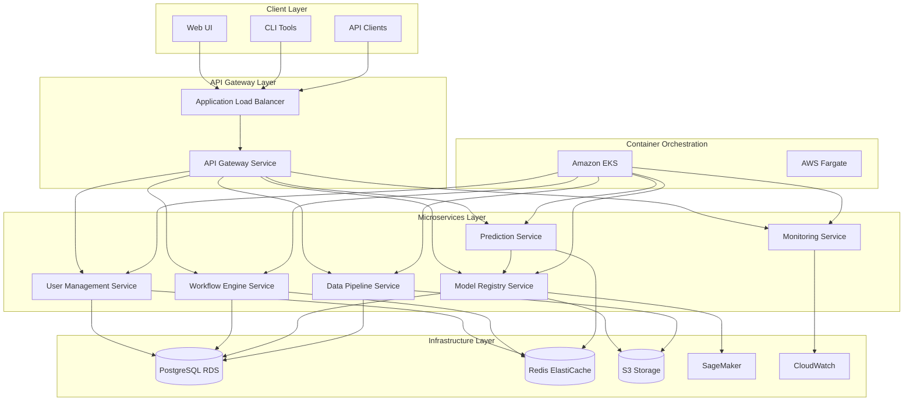

# Design Document: ML Workflow Orchestration Platform

## Overview

The ML Workflow Orchestration Platform is a cloud-native, microservices-based system built on FastAPI that provides comprehensive machine learning lifecycle management. The platform demonstrates enterprise-level capabilities across Python Backend Engineering, AWS DevOps, and MLOps domains through a production-ready architecture that supports model training, deployment, monitoring, and governance at scale.

The system follows modern architectural patterns including Domain-Driven Design (DDD), Clean Architecture principles, and event-driven communication to ensure scalability, maintainability, and operational excellence. Built on AWS cloud infrastructure with Kubernetes orchestration, the platform provides robust security, monitoring, and compliance capabilities suitable for enterprise environments.

## Architecture

### High-Level Architecture

The platform follows a microservices architecture pattern with clear separation of concerns and domain boundaries. The system is designed around the following core domains:



### Service Architecture Patterns

**Microservices Communication:**
- Synchronous communication via REST APIs for request-response patterns
- Asynchronous communication via message queues (Redis Streams) for event-driven workflows
- Service mesh (Istio) for traffic management, security, and observability
- Circuit breaker pattern implementation for resilience

**Data Architecture:**
- Command Query Responsibility Segregation (CQRS) for read/write optimization
- Event sourcing for audit trails and state reconstruction
- Database per service pattern for data isolation
- Shared data access through well-defined APIs

## Components and Interfaces

### User Management Service

**Responsibilities:**
- JWT-based authentication and authorization
- Role-based access control (RBAC) management
- User profile and session management
- Security policy enforcement

**Key Components:**
- `AuthenticationController`: Handles login, logout, token refresh
- `UserRepository`: Database operations for user data
- `RoleService`: Manages user roles and permissions
- `JWTService`: Token generation and validation
- `PasswordService`: Secure password hashing and validation

**External Interfaces:**
- REST API endpoints for authentication operations
- Internal gRPC interface for service-to-service authentication
- Integration with external identity providers (OAuth2, SAML)

### Workflow Engine Service

**Responsibilities:**
- ML workflow definition and validation
- Job scheduling and execution orchestration
- Workflow state management and monitoring
- Dependency resolution and task coordination

**Key Components:**
- `WorkflowController`: REST API for workflow operations
- `JobScheduler`: Manages workflow execution timing
- `TaskExecutor`: Executes individual workflow tasks
- `WorkflowRepository`: Persists workflow definitions and state
- `EventPublisher`: Publishes workflow events for monitoring

**Workflow Definition Schema:**
```python
class WorkflowDefinition:
    name: str
    version: str
    tasks: List[TaskDefinition]
    dependencies: Dict[str, List[str]]
    schedule: Optional[ScheduleConfig]
    retry_policy: RetryPolicy
    timeout: int
```

### Model Registry Service

**Responsibilities:**
- ML model version management and metadata storage
- Model artifact storage and retrieval
- Model approval workflow and governance
- Integration with SageMaker Model Registry

**Key Components:**
- `ModelController`: REST API for model operations
- `ModelVersionService`: Manages model versioning and lineage
- `ArtifactStorage`: Handles model artifact storage in S3
- `ApprovalWorkflow`: Manages model approval process
- `MetricsCollector`: Collects and stores model performance metrics

**Model Metadata Schema:**
```python
class ModelVersion:
    model_id: str
    version: str
    framework: str
    algorithm: str
    training_data_hash: str
    hyperparameters: Dict[str, Any]
    metrics: Dict[str, float]
    approval_status: ApprovalStatus
    created_at: datetime
    created_by: str
```

### Data Pipeline Service

**Responsibilities:**
- ETL pipeline definition and execution
- Data validation and quality checks
- Data lineage tracking
- Integration with AWS data services

**Key Components:**
- `PipelineController`: REST API for pipeline operations
- `DataValidator`: Implements data quality checks
- `ETLEngine`: Executes data transformation tasks
- `LineageTracker`: Tracks data lineage and dependencies
- `QualityMonitor`: Monitors data quality metrics

### Prediction Service

**Responsibilities:**
- Real-time model inference serving
- Batch prediction processing
- A/B testing and traffic routing
- Prediction result caching and optimization

**Key Components:**
- `PredictionController`: REST API for inference requests
- `ModelLoader`: Loads and manages model instances
- `ABTestingRouter`: Routes requests for A/B testing
- `CacheManager`: Manages prediction result caching
- `BatchProcessor`: Handles batch prediction requests

## Data Models

### Core Domain Models

**User and Authentication:**
```python
class User:
    id: UUID
    username: str
    email: str
    password_hash: str
    roles: List[Role]
    created_at: datetime
    last_login: Optional[datetime]
    is_active: bool

class Role:
    id: UUID
    name: str
    permissions: List[Permission]
    description: str

class Permission:
    id: UUID
    resource: str
    action: str
    conditions: Optional[Dict[str, Any]]
```

**Project and Workflow:**
```python
class Project:
    id: UUID
    name: str
    description: str
    owner_id: UUID
    team_members: List[UUID]
    created_at: datetime
    updated_at: datetime
    status: ProjectStatus

class Workflow:
    id: UUID
    project_id: UUID
    name: str
    definition: WorkflowDefinition
    version: str
    status: WorkflowStatus
    created_by: UUID
    created_at: datetime

class Job:
    id: UUID
    workflow_id: UUID
    status: JobStatus
    started_at: Optional[datetime]
    completed_at: Optional[datetime]
    logs: List[LogEntry]
    metrics: Dict[str, Any]
```

**Model and Dataset:**
```python
class Model:
    id: UUID
    project_id: UUID
    name: str
    description: str
    framework: str
    created_by: UUID
    created_at: datetime

class ModelVersion:
    id: UUID
    model_id: UUID
    version: str
    artifact_uri: str
    metadata: ModelMetadata
    status: ModelStatus
    approval_status: ApprovalStatus
    created_at: datetime

class Dataset:
    id: UUID
    project_id: UUID
    name: str
    description: str
    s3_uri: str
    schema: DatasetSchema
    size_bytes: int
    created_at: datetime
```

### Database Schema Design

**PostgreSQL Schema Organization:**
- Separate schemas for each service domain
- Shared reference data in common schema
- Audit tables for compliance and tracking
- Optimized indexes for query performance

**Key Design Patterns:**
- UUID primary keys for distributed system compatibility
- Soft deletes with `deleted_at` timestamps
- Optimistic locking with version fields
- JSON columns for flexible metadata storage
- Proper foreign key constraints and cascading rules

## Correctness Properties

*A property is a characteristic or behavior that should hold true across all valid executions of a system—essentially, a formal statement about what the system should do. Properties serve as the bridge between human-readable specifications and machine-verifiable correctness guarantees.*

Now I need to analyze the acceptance criteria to determine which ones can be tested as properties.

### Authentication and Authorization Properties

**Property 1: JWT Authentication Consistency**
*For any* valid user credentials, authentication should always return a valid JWT token that can be used to access authorized resources
**Validates: Requirements 1.1, 1.2**

**Property 2: Role-Based Access Control**
*For any* user with specific roles, access to protected resources should be granted or denied consistently based on their role permissions
**Validates: Requirements 1.2, 1.3**

**Property 3: Session Expiration Enforcement**
*For any* expired JWT token, all protected operations should be rejected and require re-authentication
**Validates: Requirements 1.4**

### Workflow and Job Management Properties

**Property 4: Workflow Execution Tracking**
*For any* workflow execution, a corresponding job instance should be created with proper status tracking and audit logging
**Validates: Requirements 2.3, 2.4**

**Property 5: Project Ownership Consistency**
*For any* ML project created by a user, the project should be properly associated with the creator and accessible through project queries
**Validates: Requirements 2.1, 2.5**

**Property 6: Workflow Definition Validation**
*For any* workflow definition, validation should consistently accept valid definitions and reject invalid ones with appropriate error messages
**Validates: Requirements 2.2**

### Model Lifecycle Properties

**Property 7: Model Version Creation**
*For any* successful model training completion, a new model version should be created with complete metadata, performance metrics, and lineage information
**Validates: Requirements 3.3, 3.6**

**Property 8: Model Deployment Consistency**
*For any* deployed model version, the model should be accessible via prediction API endpoints and properly integrated with the prediction service
**Validates: Requirements 3.4**

**Property 9: A/B Testing Traffic Routing**
*For any* prediction request when multiple model versions exist, traffic should be routed according to A/B testing configuration rules
**Validates: Requirements 3.5**

### Data Pipeline Properties

**Property 10: Data Storage with Metadata**
*For any* data upload (training data, pipeline output), the data should be stored in S3 with complete metadata, proper versioning, and access controls
**Validates: Requirements 3.1, 4.4, 7.2**

**Property 11: Pipeline Validation and Execution**
*For any* data pipeline definition, validation should work correctly, and execution should include data quality checks with proper error handling
**Validates: Requirements 4.1, 4.2, 4.3**

**Property 12: Pipeline Monitoring and Alerting**
*For any* pipeline execution with monitoring enabled, metrics should be tracked and alerts should be sent for failures or performance issues
**Validates: Requirements 4.5**

### API Gateway and Service Properties

**Property 13: Request Routing Consistency**
*For any* API request, the gateway should route it to the correct microservice based on URL patterns, with circuit breaker protection when services are unavailable
**Validates: Requirements 5.1, 5.2**

**Property 14: API Documentation Completeness**
*For any* API documentation request, complete OpenAPI/Swagger documentation should be served for all available endpoints
**Validates: Requirements 5.4**

### Security Properties

**Property 15: Secure Communication Enforcement**
*For any* API request, HTTPS/TLS encryption should be enforced and HTTP requests should be rejected
**Validates: Requirements 8.1**

**Property 16: Password Security**
*For any* user password storage, passwords should be securely hashed with salt and plain text passwords should never be stored
**Validates: Requirements 8.2**

**Property 17: Rate Limiting Protection**
*For any* high-frequency API requests from the same source, rate limiting should be enforced to prevent abuse
**Validates: Requirements 8.3**

**Property 18: Audit Trail Completeness**
*For any* user action or system event, complete audit logs should be created with timestamps, user identification, and structured data
**Validates: Requirements 8.4**

### Monitoring and Observability Properties

**Property 19: Metrics Collection Consistency**
*For any* system operation, relevant metrics (response times, error rates, resource utilization) should be collected and stored properly
**Validates: Requirements 6.4, 9.1**

**Property 20: Structured Logging with Tracing**
*For any* request or system event, structured logs should be generated with correlation IDs for distributed tracing across microservices
**Validates: Requirements 9.2, 9.5**

**Property 21: Monitoring Dashboard Availability**
*For any* monitoring dashboard request, current system health and performance indicators should be accessible and up-to-date
**Validates: Requirements 9.3**

**Property 22: Alert Notification Delivery**
*For any* critical system issue, alerts should be sent through all configured notification channels (email, Slack, PagerDuty)
**Validates: Requirements 9.4**

### Performance and Caching Properties

**Property 23: Caching Performance Optimization**
*For any* frequently accessed data, Redis caching should improve response times compared to direct database access
**Validates: Requirements 7.3**

## Error Handling

The platform implements comprehensive error handling strategies across all microservices to ensure robust operation and clear error communication:

### Error Classification and Response Patterns

**Client Errors (4xx):**
- 400 Bad Request: Invalid request format or missing required parameters
- 401 Unauthorized: Authentication required or invalid credentials
- 403 Forbidden: Insufficient permissions for requested operation
- 404 Not Found: Requested resource does not exist
- 409 Conflict: Resource conflict (e.g., duplicate model version)
- 422 Unprocessable Entity: Valid request format but invalid business logic
- 429 Too Many Requests: Rate limiting exceeded

**Server Errors (5xx):**
- 500 Internal Server Error: Unexpected server-side errors
- 502 Bad Gateway: Upstream service unavailable
- 503 Service Unavailable: Service temporarily unavailable
- 504 Gateway Timeout: Upstream service timeout

### Error Response Format

All error responses follow a consistent JSON structure:
```json
{
  "error": {
    "code": "VALIDATION_ERROR",
    "message": "Invalid workflow definition",
    "details": {
      "field": "tasks",
      "reason": "Missing required task type"
    },
    "correlation_id": "req_123456789",
    "timestamp": "2024-01-15T10:30:00Z"
  }
}
```

### Circuit Breaker Implementation

Services implement circuit breaker patterns for external dependencies:
- **Closed State**: Normal operation, requests pass through
- **Open State**: Failures exceed threshold, requests fail fast
- **Half-Open State**: Limited requests allowed to test recovery

### Retry Strategies

**Exponential Backoff**: For transient failures with jitter to prevent thundering herd
**Dead Letter Queues**: For failed async operations requiring manual intervention
**Idempotency**: All operations designed to be safely retryable

## Testing Strategy

The platform employs a comprehensive dual testing approach combining unit tests for specific scenarios and property-based tests for universal correctness validation.

### Property-Based Testing Framework

**Technology Stack:**
- **Python**: Hypothesis library for property-based testing
- **Test Configuration**: Minimum 100 iterations per property test
- **Integration**: pytest framework with custom property test markers

**Property Test Implementation Pattern:**
```python
from hypothesis import given, strategies as st
import pytest

@pytest.mark.property_test
@given(
    user_credentials=st.builds(UserCredentials, 
                              username=st.text(min_size=3, max_size=50),
                              password=st.text(min_size=8, max_size=128))
)
def test_jwt_authentication_consistency(user_credentials, auth_service):
    """
    Feature: ml-workflow-platform, Property 1: JWT Authentication Consistency
    For any valid user credentials, authentication should always return 
    a valid JWT token that can be used to access authorized resources
    """
    # Create user with valid credentials
    user = auth_service.create_user(user_credentials)
    
    # Authenticate and get JWT token
    token = auth_service.authenticate(user_credentials)
    
    # Verify token is valid and can access authorized resources
    assert token is not None
    assert auth_service.validate_token(token) == user.id
    assert auth_service.can_access_resource(token, "user_profile")
```

### Unit Testing Strategy

**Coverage Requirements:**
- Minimum 80% code coverage across all microservices
- Focus on edge cases, error conditions, and integration points
- Mock external dependencies for isolated testing

**Key Testing Areas:**
- **Authentication Edge Cases**: Invalid tokens, expired sessions, malformed requests
- **Workflow Validation**: Invalid task definitions, circular dependencies, resource constraints
- **Data Pipeline Errors**: Malformed data, validation failures, storage errors
- **Model Registry**: Version conflicts, approval workflow edge cases
- **API Gateway**: Routing failures, circuit breaker activation, rate limiting

### Integration Testing

**Service Integration Tests:**
- Test inter-service communication patterns
- Validate async message handling
- Verify database transaction consistency
- Test external service integrations (SageMaker, S3, CloudWatch)

**End-to-End Workflow Tests:**
- Complete user journeys from authentication to model deployment
- Multi-service transaction validation
- Performance testing under load
- Disaster recovery scenarios

### Test Environment Management

**Containerized Test Environments:**
- Docker Compose for local development testing
- Kubernetes test clusters for integration testing
- Isolated test databases and message queues

**Test Data Management:**
- Synthetic data generation for consistent testing
- Test data cleanup and isolation
- Performance test data sets for load testing

**Continuous Testing Pipeline:**
- Automated test execution on code changes
- Property test execution with extended iteration counts
- Performance regression testing
- Security vulnerability scanning